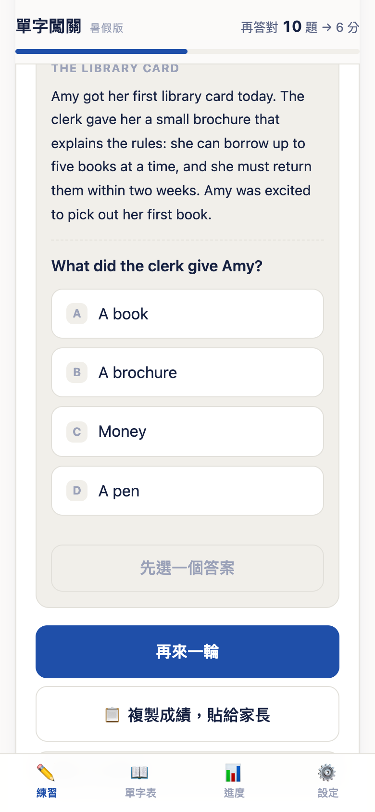

# 單字闖關

[](https://github.com/KU-isaki/vocab-quest-k7m2/actions/workflows/test.yml)

國中英語單字的手機練習網頁。**單一 HTML 檔、無後端、無安裝、離線可用**，打開就能練。

給自己家小孩做的家庭學習小工具，開源出來給有需要的人。

<p align="center">
  
  
  
  
  
  
</p>
<p align="center"><sub>主畫面 · 點字母拼英文 · 遊戲時間存摺 · 練習日曆 · 設定 · 閱讀題組</sub></p>

---

## 快速開始

**用網頁版**：<https://ku-isaki.github.io/vocab-quest-k7m2/>

打開就能用，不用註冊、不用安裝。建議「加入主畫面」當 App 用（iOS：分享 → 加入主畫面；Android：選單 → 加到主畫面）。

**自己架一份**：

```bash
git clone https://github.com/KU-isaki/vocab-quest-k7m2.git
```

`index.html` 就是全部。用瀏覽器打開它即可，或推到任何靜態空間（GitHub Pages、Netlify、自己的伺服器都行）。

**自己改內容**：整份工具只有一個檔案，單字、例句、樣式、程式碼全在裡面。見下方「[改成自己的單字](#改成自己的單字)」。

**跑測試**：

```bash
npm install   # 只需要 jsdom
npm test      # 1130+ 項端到端測試
```

---

## 它能做什麼

### 兩個題庫

主畫面上方切換，**進度各自獨立計算、互不干擾**。題庫選擇只出現在**練習**與**單字表**兩頁 ——
進度頁只有一半內容跟題庫有關（存摺和日曆是共用的）、設定頁只有清除鈕用得到，
那兩頁改用文字標明（「暑假版 的成績」「練習日曆 · 兩個題庫共用」），要換題庫回練習頁換。

| 題庫 | 內容 |
|------|------|
| **暑假版** | 114 字，5 類（人物身份／個人特徵／身體部位／健康狀況／稱謂） |
| **總整理版** | 1206 字，37 類（附每章記憶口訣） |

### 五種題型自動混合

| 題型 | 做什麼 | 為什麼這樣設計 |
|------|--------|----------------|
| 看英文 → 選中文 | 附發音，提示「先自己念一次再選」；**點選項只是選起來，還可以改，按「檢查」才送出** | 認得出來是基本盤；手指滑到就判錯很冤 |
| 看中文 → **點字母拼英文** | 打散的字母方塊點選，可退格；**沒拼滿不能按「檢查」**，按鈕也刻意離字母遠一點 | 手機打字太痛苦，會直接勸退；按鈕太近會誤按送出錯答案 |
| **看句子填單字** | 例句挖空，用點字母的方式填 | 只背單字沒有語境 |
| **只聽發音 → 選中文** | 有大喇叭鈕可重聽 | 會考有聽力題 |
| 打出英文 | 鍵盤輸入 | 最難的一關，靠**難度**決定多常出現 |

### 題數 × 難度矩陣

開始練習前選兩件事，任意組合：

| 列 | 選項 | | |
|---|---|---|---|
| **題數** | 10 題（暖身） | 30 題（標準一輪） | 50 題（衝刺） |
| **難度** | 🌱 輕鬆 ×0.8 | ⚖️ 標準 ×1 | 🔥 挑戰 ×1.5 |

難度**只改題型配方和分鐘倍率，不會減少題數**：

| 難度 | 打字題 | 聽力題 | 升級到打字題的門檻 | 遊戲時間 |
|---|---|---|---|---|
| 輕鬆 | 少 | 少 | 連對 3 次 | ×0.8 |
| 標準 | 中 | 中 | 連對 2 次 | ×1 |
| 挑戰 | 多 | 多 | 連對 1 次 | ×1.5 |

打字題（自己拼出來、沒有字母可點）和聽力題（沒有英文可看）是最難的兩種，
挑戰模式下這兩種合起來約占七成，輕鬆模式約三成半。同樣做 30 題，
輕鬆換到 12 分鐘、標準 15 分鐘、挑戰 23 分鐘。

**倍率算的是「當天實際作答的平均」，不是切換當下的難度** —— 否則就能用輕鬆模式刷滿題數、
最後切到挑戰回頭領獎。每答一題就把當時的倍率累加起來，除以題數才是當天的倍率。

### 記憶排程（間隔重複）

答對的字排到 **1 → 3 → 7 → 14 → 30 天**後才會再出現，答錯的立刻排回來。

「已熟練」只算**連對 2 次且還沒到複習日**的字 —— 這樣這個數字才不會虛胖，家長看到的成效才是真的。

### 哪些紀錄是共用的

**練習日曆和遊戲時間存摺是兩個題庫共用的** —— 「今天練了幾題」「連續幾天」「賺到幾分鐘」
是習慣與獎勵，同一天在兩個題庫練的題數會合計。

單字本身的統計（答對率、已熟練、待加強）則分題庫各記各的，因為那是兩份不同的學習進度。

清除紀錄也分成兩個按鈕（都需要家長密碼，如果有設）：清除某個題庫的答題紀錄、
清除共用的日曆與遊戲時間。

### 練習換遊戲時間

**答對 1 題 +1，答錯 1 題 -1**，用算出來的「淨題數」換遊戲時間（淨題數最低算到 0，不會變負）。
給的是**累計到該階的總額**，所以分三次做和一次做拿到的一樣多：

| 當日累積 | 可得 |
|---|---|
| 10 題 | 2 分鐘 |
| 20 題 | 5 分鐘 |
| 30 題 | 15 分鐘 |
| 50 題 | 30 分鐘 |
| 80 題 | 60 分鐘 |

算出來的分鐘再乘上**兩個倍率**：

| 倍率 | 依據 | 級距 |
|---|---|---|
| **難度** | 自己選的難度 | 輕鬆 ×0.8　·　標準 ×1　·　挑戰 ×1.5 |
| **答對率** | 當天實際的答對率 | 95%↑ ×1.2　·　85%↑ ×1.1　·　70%↑ ×1　·　50%↑ ×0.85　·　50% 以下 ×0.7 |

所以「淨題數一樣」不代表拿到一樣多。淨 30 題的三種走法：

| 走法 | 答對率 | 拿到 |
|---|---|---|
| 對 30、錯 0 | 100% | **18 分鐘** |
| 對 40、錯 10 | 80% | 15 分鐘 |
| 對 60、錯 30 | 67% | 13 分鐘 |

**為什麼還要加答對率這層？** 淨題數只把答錯扣一次，「猜錯了再多做幾題補回來」仍然划算。
答對率直接乘在分鐘上之後，仔細作答就比硬刷題數值錢。

一天上限 60 分鐘，**連續 7 天多送 30 分鐘**。一次兌換 15 分鐘。

**存摺會跨日累積，不會每天歸零。** 60 分鐘是「一天最多能賺多少」，不是「最多能存多少」——
沒用掉的分鐘一直留著，隔天照樣往上加。每天的級距則是從 0 題重新算（今天做幾題只看今天）。

答錯會即時把已發放的分鐘**扣回來**（淨題數掉一階、答對率也可能掉一級），
畫面會跳「答錯扣抵」提示，之後再答對又會賺回去。這是為了讓亂猜沒有好處。

兌換時可以：設 4 位數家長密碼、自動複製申請訊息給家長、開始倒數計時（存的是結束時間，關掉網頁再回來也算得準）。

**家長密碼會同時保護**：兌換遊戲時間、贈送／沒收遊戲時間、發加倍券、
**用備份碼還原**、清除題庫紀錄、清除日曆與存摺 —— 都是誤觸或被繞過會出事的操作。

還原之所以要密碼，是因為它是**整包覆寫**：小孩貼一張舊備份碼就能把被沒收的分鐘救回來、
把用掉的加倍券變回庫存。破壞力跟「清除紀錄」同一級。

### 家長可以直接贈送（或沒收）遊戲時間

設定頁的「家長設定」有兩顆鈕：**🎁 贈送遊戲時間**、**➖ 沒收遊戲時間**。
要密碼，而且**一定要填原因**（20 字以內），一次最多 60 分鐘。

送出去的分鐘跟練習賺的**完全分開記成另一本帳**，因為混在一起會出事：

| 混進去會怎樣 | 為什麼 |
|---|---|
| 送完的分鐘，小孩練一下就不見了 | `checkGoal` 每答一題就拿「今天應得幾分鐘」跟「已經發了幾分鐘」對帳，多出來的會被當成誤發直接倒扣 |
| 送一次賺兩次 | 連續天數只看「那天有沒有拿到分鐘」，被送的日子會偽裝成達標日，湊滿 7 天再多領 30 分鐘紅利 |
| 存摺上的數字不再誠實 | `bank.earned` 的語意是「練習賺到的」 |

所以贈送**不算連續天數、不占一天 60 分鐘的上限、也不會被答錯倒扣**。
上限是練習的規則，跟爸媽送禮無關。

**帳本只增不改**：送錯了不是把那筆刪掉，而是用「沒收」記一筆負的沖銷回去。
這樣紀錄永遠查得出來歷 —— 包括小孩知道密碼、自己偷送自己的情況（會多出一筆你沒印象的紀錄）。

**「原因必填」本身就是護欄**：它強迫家長講出一個「不是因為練習」的理由（幫忙做家事、
生日、考試進步），獎勵的因果才不會跟練習機制混在一起。

### 加倍券：要練才拿得到的獎勵

設定頁還有第三顆鈕：**✨ 發一張加倍券**。一樣要密碼和原因，但它給的不是分鐘，是**權利**。

| | 直接贈送 | 加倍券 |
|---|---|---|
| 小孩拿到什麼 | 分鐘，馬上進存摺 | 「下次練習那天分鐘 ×2」 |
| 不練會怎樣 | 照樣拿得到 | **拿不到，券也不會消失**，繼續存著 |
| 每日上限 | 不受 60 分鐘上限管 | 上限跟著加倍成 **120 分鐘** |
| 答錯 | 不受影響 | **倒扣也一樣加倍** |

發出去先存著，小孩**下一次練習的那天自動用掉**（一天只吃一張），日曆上那天會標出來。
沒練就不會被用掉，所以不會白發、也不用挑時間發。

**券只在「那天的第一題」生效。** 如果發券的時候小孩今天已經開始練了，這張券會留到隔天，
不會半路插進去。這條規則不是潔癖，是補一個真的存在的漏洞 —— 見下方「設計取捨」。

**為什麼上限要跟著放寬？** 不放寬的話，券在「本來就快練滿 60 分鐘」的日子等於沒送 ——
而那天往往正是最該獎勵的一天。

**為什麼答錯的倒扣也加倍？** 券的語意是「這天每一題都值雙倍」。只加倍獎勵、不加倍代價的話，
持券那天亂猜就變得划算了 —— 那正是整套機制一直在防的事。

### 這台裝置是誰在用

設定頁最上面可以填一個名字，**只存在這台裝置裡、不會傳到任何地方**，畫面上也只有設定頁看得到，
填不填都不影響任何功能。換手機時它會跟著備份碼一起搬過去。

先做這個是為了以後：家裡不只一個小孩、要把兩個人的紀錄分開來看的時候會需要它。
現在留著只是佔一個位子。

### 雲端備份與家長檢視（選用）

備份碼會隨使用量長大，遲早貼不進一則 LINE 訊息（見上方「進度會不會不見」）。
而且家裡不只一個小孩的話，「叫他傳給我」本身就是個麻煩。所以做了一套自架的同步。

**架構**：`worker/` 是一支 Cloudflare Worker + KV，`parent.html` 是家長的唯讀儀表板。
兩者都在免費額度內，資料只進你自己的 Cloudflare 帳號，沒有第三方。

| 誰 | 拿到什麼鑰匙 | 能做什麼 |
|---|---|---|
| 小孩的裝置 | 寫入碼 | 只能 `PUT` 上傳自己的進度 |
| 家長 | 讀取碼 | 只能 `GET` 讀，**碰不到任何寫入路徑** |

**「唯讀」是在 Worker 的路由層擋掉的，不是靠畫面上不放按鈕** —— 後者只要打開
開發者工具就破功。`tests/worker.js` 把「拿錯鑰匙 × 用錯方法」的每一種組合都試過一遍。

家長那頁除了看，還有一顆「⬇️ 取得備份碼」：把雲端最新那份完整備份碼撈出來，
可以複製也可以存成 `.txt`。**小孩手機被清掉時，家長自己就能救**，不用等他配合。
走的是 `/p/snap/:child`，一樣只有 GET。

日常已經不需要再手動複製備份碼了 —— 真正該自己留存的是那兩段 `CQS1:` / `CQP1:` 設定碼，
那個掉了要重新產密鑰、重新部署、兩台手機都要重設。

家長那頁只回答三個問題，不做成資料儀表板：

1. **這兩週有沒有在練** — 十四根柱子、連續天數、近七天題數
2. **哪幾個字一直錯** — 兩個題庫各列前幾個，附中文和錯幾次
3. **送的獎勵有沒有效** — 送獎勵的日子在圖上標 🎁，直接看那之後的柱子有沒有變高

**上傳頻率是每輪一次，不是每題一次。** KV 免費方案每天 1000 次寫入，
每題傳一次一定爆掉；而且家長也不需要看到即時的每一題。

**自己架一份**（全部在 Cloudflare 免費額度內）：

```bash
cd worker
npx wrangler login
npx wrangler kv namespace create VQ     # 把回傳的 id 填進 wrangler.jsonc
npx wrangler deploy                     # 順便綁自訂網域
npx wrangler secret put WRITE_CODE      # 小孩裝置用的碼
npx wrangler secret put READ_CODE       # 家長儀表板用的碼
```

`wrangler.jsonc` 裡要改的是 `name`、`ALLOW_ORIGIN`、`routes` 三處。
小孩端和家長端貼的「設定碼」是 `CQS1:` / `CQP1:` 加上 `{"api":"…","code":"…"}` 的 base64。

> **API 一定要放在 App 之外的另一個子網域。** 同網域的話，API 回應會掉進
> service worker 那條「先給快取」的路徑，家長會讀到舊資料。
> 另外 Cloudflare 免費憑證只涵蓋一層子網域，所以是 `x-api.你的網域` 而不是 `api.x.你的網域`。

### 其他

- **頂端進度條**：每頁都看得到「再答對 6 題 → 17 分」，直接講還差幾題、換得到幾分鐘；到上限顯示「今日上限已滿 ✓」。長按可看今天實際答對／答錯幾題
- **練習日曆**：兩種檢視。**預設「這個月」**——一般月曆版面，一頁排得下、不用左右捲，可以往回翻月，下面有當月小結（練了幾天、幾題、賺到幾分鐘、爸媽送了幾分鐘）；另一種是「最近半年」GitHub 風格熱力圖。兩種都依題數深淺上色、達標的日子有綠框、**有家長贈送／沒收的日子多一個黃色記號**、點格子看當天紀錄（含贈送的分鐘與原因）
- **單字表**：分類鈕篩選、搜尋中英文、點 🔊 發音、點 ⌄ 展開用法解釋與例句、顯示個人答對率
- **複習模式**：選好分類按「📇 複習這 N 個字」進入翻卡。正面英文（自動發音）→ 點卡片翻到中文、用法、例句；可切換「先看中文」反向複習。**完全不計分、不影響任何統計**
- **用法解釋 222 條**：答錯時才顯示（答對不打斷節奏），單字表可隨時展開
- **成績回報**：一鍵複製成績文字，貼到 LINE 給家長
- **可以裝成 App**：加到主畫面後有自己的圖示、全螢幕、**完全離線可用**；有新版時會跳出「立即更新」
- **四個分頁**：練習 · 單字表 · 進度 · **設定**。設定頁放顯示設定、家長密碼、備份、清除紀錄；進度頁只留成果（存摺、統計、日曆、待加強）
- **說明點一下才展開**：規則細節（分鐘怎麼算、日曆圖例、備份說明、密碼保護什麼）平常收起來，用瀏覽器原生的 `<details>`，不用自己寫展開邏輯
- **顯示設定**：字體四段大小可調、配色可選跟隨系統／淺色／深色
- **句子層級的題型**：🔊 聽例句選出正確中文（吃聽力題開關）、看中文選出正確英文句——選項都是完整例句，跟一般題一樣計分
- **例句也能發音**：單字表展開的例句、複習翻卡背面的例句都有 🔊 鈕，按了念整句（兩個題庫都適用）
- **每輪結算頁附一小段閱讀題組**：一段短文（約 40-90 字）配兩題四選一，練「讀懂一段英文再回答」而不是單字記憶。跟計分、獎勵時間**完全脫鉤**——純粹的閱讀練習，不會被拿去刷分鐘數，也不會被難度/答對率的獎勵機制影響。30 篇文章輪替、每篇有 8 題的題目池、每次隨機抽 2 題（240 題），同一篇不會連續出現兩輪，重複遇到也幾乎不會是同樣的題目組合

---

## 隱私

**預設不傳，開了才傳。** 這個網頁有兩種模式：

| | 預設（不設定雲端備份） | 開啟雲端備份之後 |
|---|---|---|
| 對外請求 | **一個都沒有** | 每練完一輪傳一次進度到你自己的 Cloudflare |
| 資料在哪 | 只在使用者自己的瀏覽器 | 瀏覽器 + 你自己的雲端空間 |
| 誰看得到 | 只有拿著那台裝置的人 | 加上拿著家長鑰匙的人 |

**預設是關的。** 沒有在設定頁貼上雲端設定碼的話，這個網頁跟以前完全一樣：
沒有後端、沒有分析工具、沒有 cookie、**一個外部請求都不會發出去**。

開啟之後設定頁會一直顯示「已開啟」和最後同步時間 —— **不會偷偷傳**。
這是刻意的：這個 App 的其他地方都堅持數字要誠實（存摺欠幾分鐘會標出來、
「已熟練」不虛胖），同步這件事沒有理由例外。

- 答題進度、錯題本、遊戲時間存摺全部存在**使用者自己瀏覽器的 localStorage**
- 別人打開同一個網址，看到的是全新的空白進度
- 「複製成績給家長」只是把文字放進剪貼簿，由使用者自己決定要不要貼出去

**刻意不做的事**：不用 `line.me/R/msg/text/?...` 那種把訊息塞進網址的分享方式 —— 那會把成績整段送到 LINE 的伺服器，也會留在瀏覽器歷史紀錄裡。

### 進度會不會不見？

會。localStorage 在下列情況會被清掉：換瀏覽器、清除瀏覽資料、iOS Safari 長時間沒開啟該網站。

所以做了**備份碼**：設定頁按「📋 複製備份碼」，把兩個題庫的紀錄壓成一段文字，需要時貼回來還原。
舊版的 `CQ2:`、`CQ3:` 備份碼一樣還原得回來。

**注意它會長大。** 實測：空進度 32 字元、輕度使用約 3,000 字元，但**練滿兩個題庫加 200 天日曆會膨脹到 4 萬字元**，
超過 LINE 單則訊息的上限。所以「複製貼給家長」這條路有保質期，真的要長期用得換別的辦法。

---

## 已知限制

| 狀況 | 說明 |
|------|------|
| **iPhone 側邊靜音開關打開時完全沒聲音** | iOS 的限制，程式救不了。所有題目都看得到英文字，沒聲音仍可正常作答；聽力題也可以在主畫面一鍵關掉 |
| **LINE 內建瀏覽器可能沒聲音、無法自動複製** | 偵測到會自動跳提示，請用右上角 `⋯` →「用其他瀏覽器開啟」。複製失敗時會跳出面板讓你長按手動複製 |
| **換瀏覽器開進度會歸零** | localStorage 是分瀏覽器的，請固定用同一個。或用備份碼搬移 |
| **語音品質看裝置** | 用的是瀏覽器內建的 `speechSynthesis`，各家發音品質不同。沒有預錄音檔，換取的是檔案小、零維護 |

---

## 改成自己的單字

整份工具就是 `index.html` 一個檔案，用任何編輯器打開，找到對應區塊改就好。改完存檔、重開網頁即可。若是用 GitHub Pages 發布，`git push` 後最多 10 分鐘生效（網址不變）。

### 一輪幾題、獎勵多少

```js
const ROUND  = 30;        // 預設一輪幾題
const SIZES  = [{n:10,tag:"暖身"},{n:30,tag:"標準一輪"},{n:50,tag:"衝刺"}];   // 題數矩陣第一列
const LEVELS = [             // 難度矩陣第二列：mul 是分鐘倍率
  {id:"easy", name:"🌱 輕鬆", mul:0.8, note:"多選擇題，打字題少"},
  {id:"std",  name:"⚖️ 標準", mul:1,   note:"各種題型平均出"},
  {id:"hard", name:"🔥 挑戰", mul:1.5, note:"打字題與聽力題變多"}
];
const MIX = {                // 每個難度的題型配方
  easy: {listen:.15, need:3, typeP:.25, kinds:["spell","en2zh","en2zh","en2zh"], ear:1},
  // listen=不能拼的字改出聽力題的機率、need=連對幾次才升級打字題、
  // typeP=符合條件時真的出打字題的機率、kinds=其餘題型的抽籤袋、ear=聽力題在袋子裡放幾張
};
const TIERS  = [{n:10,m:2},{n:20,m:5},{n:30,m:15},{n:50,m:30},{n:80,m:60}];  // 當日淨題數 → 可換的分鐘數
const ACC    = [             // 當日答對率 → 分鐘倍率（由高到低，第一個命中的算數）
  {p:.95,m:1.2,name:"幾乎全對"},{p:.85,m:1.1,name:"很穩"},{p:.70,m:1,name:"及格"},
  {p:.50,m:.85,name:"要小心"},{p:0,m:.7,name:"太多錯"}
];
const SPEND  = 15;        // 一次兌換幾分鐘
const STREAK_BONUS = 30;  // 連續 7 天的紅利分鐘
```

畫面上的文案會自動跟著這些數字變，不用另外改。

### 單字

```js
const SUMMER_WORDS = [
["單字", "中文意思", "提示（可留空）", "分類 id"],
];
```

分類 id 在同區塊上方的 `SUMMER_CATS` 定義。總整理版是 `FULL_WORDS`，格式是 `["單字", "中文", "分類 id（多個用逗號分隔）"]`，分類在 `FULL_CATS`（含記憶口訣）。

自動處理的事：

- 純英文字母的單字會自動加入拼字題；含 `.`、`-` 或空格的（`Mr.`、`hard-working`、`hot dog`）自動只出選擇題
- 中文一模一樣的字（`tall` / `high` 都是「高的」）會自動：不互相當干擾選項、拼字與打字題兩個都算對

### 用法解釋

```js
const NOTES = {
"honest":"形容詞，開頭 h 不發音，所以前面冠詞用 an honest man。",
};
```

兩個題庫共用，key 用小寫單字。沒寫的字就不顯示說明區塊，不用硬湊。

### 例句

```js
const EXAMPLES = {
"honest":["Please be honest with your parents.","請對你的父母誠實。"],
};
```

**例句裡一定要有該單字的原形** —— 不能只有 `taller` 這種變化形，否則挖空挖不掉。這是最容易踩的坑，測試會擋下來。

---

## 測試

用 jsdom 跑端到端測試，涵蓋：

- 答題流程、退格、錯題加權、只考錯題模式、搜尋、清除紀錄
- **選擇題要按「檢查」才送出**：點選項只做標記、可以改、不得洩漏正確答案、算的是最後選的那個
- **難度矩陣**：三種難度都要出滿選定的題數、打字題與聽力題比例隨難度遞增、倍率不得回頭追加
- **答對率倍率**：同樣的淨題數，錯越多必須拿越少；亂猜補題數不得比穩穩答還多；再高的答對率也不得破每日上限
- **出題不重複**：同一輪不得出現同一個字、不同輪的順序不得完全相同、同一個字換輪要換題型
- 題庫切換與進度隔離
- 選擇題四個選項的中文不得重複、同義字（`tall` / `high`）兩個都要算對
- **實際渲染狀態**：每個該隱藏的元素其 computed display 必須是 `none`（曾出過「複製面板一載入就跳出來」的 bug）
- **按鈕配色**：CSS 優先度不得讓通用規則蓋掉次要按鈕的文字色（曾出過白底白字的隱形按鈕）
- 中途結束一輪時分母要等於實際答題數、答對率要等於累積答對 ÷ 累積答題
- 遊戲時間：級距換算、分次做與一次做總額必須相同、密碼錯誤不得扣款、申請訊息不得含網址
- 備份碼往返後資料完全一致（含 `Mr.`、`hard-working` 這類含符號的字）
- 例句挖空：每個可拼字的字都要能被挖掉、字母數要對得上、句子裡不得洩漏答案
- 複習翻卡不得影響任何答題統計
- **設定頁**：導覽列欄數要跟分頁數一致、設定類元件要真的搬過去（進度頁不得殘留）、可展開的說明預設要收起來且內容不得為空
- **題庫選擇的顯示範圍**：四頁各自該不該出現（含 computed display，因為 `display:grid` 會蓋掉 `hidden`）、收起來的那兩頁要用文字標明題庫、換題庫後那些字要跟著換

每次 `git push` 由 GitHub Actions 自動跑一次（見上方徽章），本機用 `npm test`。

---

## 設計取捨

留給想改的人參考：

**為什麼手機不用打字？** 國中生用手機鍵盤拼英文單字很痛苦，會直接放棄。所以主力題型是「點打散的字母方塊」，鍵盤輸入只留給已經連對幾次的字（幾次由難度決定）。

**為什麼難度只加分鐘、不減題數？** 如果難度可以換成「少做幾題」，最省力的路徑就是把難度拉到最低、題數拉到最少。所以三個難度的題數門檻完全一樣，選挑戰只有一個效果：同樣的題數更難，但更值錢。

**為什麼不用預錄音檔？** 1300 多個字的 mp3 至少幾 MB，還要維護。用瀏覽器內建的 `speechSynthesis` 是零檔案、零維護，代價是各裝置發音品質不一。

**為什麼是單一 HTML 檔？** 家長不想維護。沒有 build、沒有依賴、沒有伺服器，複製一個檔案就能跑，十年後打開應該還能用。

**為什麼跨章節重複的字要合併？** 原始資料 1288 筆裡有 85 個字跨章節重複（例如 `short` 同時在「個人特徵」和「尺寸度量」）。不合併的話，選擇題會出現兩個都對的答案。

**為什麼測試要檢查 computed style？** 因為 `hidden` 屬性會被 CSS 蓋掉（`.sheet{display:grid}` 讓複製面板一載入就跳出來）、CSS 優先度會讓按鈕變成白底白字、flex 項目的 `min-height:auto` 會把日曆格子撐開、`aspect-ratio` 的自動最小尺寸會把 `1fr` 欄寬撐爆（7 欄變成 568px 塞進 358px 的容器）。這些都不是 DOM 結構的問題，只驗 DOM 抓不到。

**為什麼日曆格子的 class 要測撞名？** 月檢視的達標格子原本取名 `.goal`，撞到每日目標區塊既有的 `.goal{margin:16px 0 14px}`，達標的日子就被推低 16px、整個月曆歪掉。測試會抓出「加在格子上的修飾 class 有裸規則」這種情況。

**為什麼閱讀題組放在結算頁、不是按「開始練習」就先擋一段？** 一開始想的是每次開始練習前先跳出閱讀題組再進正式題目，但這樣會擋住 12 個測試檔、將近 30 處直接點 `btnStart` 就預期馬上進入答題畫面的假設，牽動面太大。改成附加在結算頁（`endRound()` 裡）之後，只跟 3 個檔案有關，而且對使用者體驗更好：不會延後開始練習的第一題，變成練完一輪後的收尾小活動。答對答錯也刻意不寫進 `S.done`／`SHARED.days`，避免跟已經調好的難度倍率、答對率倍率這套防刷分鐘數機制打架。

**閱讀題組上線後立刻踩到熟悉的坑**：`.btn{display:flex}` 又蓋掉了 `#readNext` 的 `hidden` 屬性——跟 `.decks`、`.sheet` 那幾個一樣的模式，只是這次踩在一顆會重複觸發的按鈕上。兩題答完後按鈕理論上要收起來，實際上還在畫面上、還能按，小孩多點幾下，「這段閱讀完成了 🎉」就一直往同一行疊加。修法一樣是補 `#readNext[hidden]{display:none}`，另外加一個 `readFinished` flag 當第二道保險（跟其他題型的 `answered` 旗標同一套邏輯），並把「按鈕該顯示的 computed style」和「連點好幾次不該重複觸發」都寫進測試釘住，不能只測 DOM 的 `hidden` 屬性。

**「結束這輪」曾是全寬按鈕，實測一直被誤觸**：`.btn` 預設 `width:100%`，結束鈕橫跨卡片底部一整條；更糟的是按「下一題」後回饋框收合、版面上移，結束鈕正好跳到手指剛才按的位置，手快連點兩下就直接跳去結算頁。修法是三件事一起：縮成置中小按鈕並跟作答區拉開距離（`#btnQuit{width:auto; margin:26px auto 0}`）、中途結束先跳一次 `confirm()` 確認（跟兌換、清除紀錄同一套原生對話框，不另做 UI）、答完最後一題才按到就直接結算不囉嗦。

**加倍券最初的寫法有一個一題換 60 分鐘的漏洞。** 原本只要「當天還沒吃過券」就會在
下一次 `checkGoal()` 把券用掉。問題在於 `checkGoal` 是**拿倍率對整天重算、再補差額**的：
小孩今天已經練滿 60 分鐘之後才發券，他只要再答**一題**（而且答錯也算），
當天的 target 就從 60 變成 120，差額 60 分鐘直接入帳。這正是整套機制一直在防的刷法，
只是這次是從家長功能那一側破的。修法是**只在那天的第一題吃券**（`day.n <= 1`），
半路發的券留到下一天 —— 剛好也跟「下一次練習那天才生效」的說法一致。

**先兌換、後答錯，存摺是會變成負的。** 這是原本就有的設計（`bankLeft()` 用 `Math.max(0, …)`
壓成 0，等於欠著、之後賺的先拿去補）。加了贈送之後這件事變得會咬人：家長送 30 分鐘，
畫面只多出 12，看起來像功能壞掉。所以另外留了一個不壓成 0 的 `bankRaw()`，
存摺會標「⚠️ 欠 N 分鐘」，贈送前的確認訊息也會先講清楚那筆負債。
**寧可醜，也不要讓家長覺得送出去的東西不見了。**

**`timingSafe("", "")` 回傳 `true`，等於密鑰沒綁時整支 API 對外全開。** 兩個空字串長度相等、
比對迴圈一次都不跑、累積的差異是 0 —— 於是「沒設定密鑰」加上「不帶 Authorization」剛好通過。
密鑰是綁在 Cloudflare 而不是在 repo 裡，所以換帳號重佈、漏跑一行 `secret put` 就會踩到，
而且**不會有任何錯誤訊息**，只會安靜地變成一間沒有門的房子。修法是兩道：`timingSafe` 拒絕空字串，
Worker 開頭再檢查一次密鑰有沒有綁，沒綁就整支回 500。寧可壞掉，也不要默默全開。

**家長儀表板的數字欄位也要轉義，不是只有文字欄位。** `esc()` 一開始只包了原因、單字這些
「看起來就是文字」的欄位，漏掉了連續天數、存摺分鐘、已熟練數量。但那些值全部來自
**小孩那台裝置上傳的 JSON**，Worker 不驗型別——傳一個字串進來就能在家長的瀏覽器裡執行程式碼。
而家長頁跟 App 同源，等於能讀走家長的鑰匙和密碼。這是「小孩改 localStorage 造假」那條
本來就存在的威脅，只是加了雲端之後從本機延伸到了家長的裝置。修法是所有數字欄位一律 `+x||0`。

**`keepalive` 的 body 上限是 64KB。** 備份碼實測滿載 41KB，加上摘要之後餘裕很小；超過的話
`fetch` 會直接被拒絕，症狀是「永遠傳不出去」而且不會自己好。門檻壓到 16KB，超過就走一般請求——
上傳時機是每輪結算，那時分頁本來就開著，不需要 keepalive 保命。

**KV 的 `list()` 一頁最多 1000 把鑰匙，而且是升冪。** 90 天的歷史一定會超過，不接 cursor 的話
拿到的是「最舊的那 1000 把」，最新的反而看不到——一個只在三個月後才會發作的 bug。
另外光有鑰匙名稱救不回東西，所以另外開了 `/p/at/:key` 讓家長真的能取回舊的那一份。

**家長儀表板為什麼要小孩端另外算一份摘要，而不是直接解備份碼？** 因為那樣
`parent.html` 就得把 `unpackDeck` 那一整套解析邏輯再抄一份。同一份格式在兩個檔案裡
各實作一次，遲早會不一致，而且那種不一致最難查。改成上傳「備份碼原文 + 一份摘要」之後，
解析邏輯只有一份，家長那頁只負責畫圖。備份碼原文還是照傳，因為那才是真的備份。

**API 為什麼放在另一個子網域？** `sw.js` 有一行 `origin !== self.location.origin` 就直接跳過，
所以跨網域的 API 請求完全不會經過 service worker。放同一個網域的話，
API 回應會掉進靜態檔那條「先給快取」的路徑，家長就會讀到舊資料。
（順帶：`english-api.ku-ai.cc` 而不是 `api.english.ku-ai.cc` —— Cloudflare 免費憑證只涵蓋一層子網域。）

**加家長頁時踩到 `sw.js` 的一個舊坑**：導覽請求的處理本來寫死
`cache.put("./index.html", res.clone())` —— 只有一頁時沒問題，但那等於「任何頁面的內容
都存成 index.html」。加了 `parent.html` 之後兩頁會互相蓋掉，離線時開哪一頁都可能拿到另一頁。
改成用 `req` 當 key 就好。

**每筆贈送與加倍券都帶著「哪台裝置、第幾號、什麼時候」。** 這三個欄位現在沒有任何功能在用，
純粹是先把格式定對 —— 之後要是想把兩個小孩、兩台裝置的紀錄合起來看，
「這兩筆是不是同一筆」只能靠一組穩定的識別碼，而時間戳不夠用：同一秒可能有兩筆，
早期版本的備份碼還原時甚至把時間戳洗成 0。這種欄位晚一年再補，等於要遷移全部歷史紀錄。

序號是**從現有紀錄推回來的**（同一台裝置的最大號 + 1），不另外存一個計數器 ——
否則還原備份之後計數器歸零，新紀錄就會跟還原進來的撞號。CQ3 舊碼還原時沒有身分可用，
會補一組從備份碼內容推出來的（`bk` + 名次）：同一張碼還原幾次都是同一組，之後去重才不會算成兩筆。

**為什麼加倍券是「下次練習那天」而不是「發的當天」？** 當天生效的話，家長得挑小孩會練的
日子發，發了沒練就浪費掉，實際上會變成「先問小孩今天要不要練」——那就本末倒置了。
改成存起來、下次練習自動用掉之後，發券這個動作跟小孩練不練完全解耦：
券只有在他真的坐下來練的那天才會被兌現。實作上是在 `checkGoal()` 進來時先 `useCoupon()`，
因為那是唯一保證「已經有作答」的入口。

**贈送為什麼要另外開一本帳，而不是直接把分鐘加進存摺？** 因為存摺那三個數字
（`earned` / `bonus` / `used`）都有明確語意，而 `checkGoal` 是一套「以當天應得分鐘為真值」
的對帳邏輯——它每答一題就重算一次、把差額補上或扣掉。任何塞進去的外來分鐘，
下一題就會被當成誤發扣回來。改成 append-only 的 `SHARED.gifts` 事件日誌之後，
一次解決四件事：日曆顯示、可追溯、沒收不用另外寫（記一筆負數就是）、
以及誤送不必刪紀錄（用負數沖銷，帳才可信）。

**備份碼為什麼要升版到 `CQ3:`？** 兩個原因。一是 `btoa()` 只吃 Latin1，
贈送原因是中文，直接塞進去會讓整個匯出功能 throw；改成先用 `encodeURIComponent`
轉 UTF-8 位元組再編碼（刻意不用 `TextEncoder`，jsdom 沒有它，測試環境跑不起來）。
二是順手修掉一個潛伏的 bug：舊格式把每天的分鐘壓成 `paid?1:0`，還原時設回 `true`，
而 `paidOf()` 讀到 `true` 會回傳一天上限 60——**還原備份之後，日曆上每個達標日
都會變成「賺到 60 分鐘」**。新格式直接存實際分鐘；舊碼還原得回來，那些天則用
當天的題數與答對率回推，總比一律當成 60 準。

**兌換從固定 15 分鐘改成自己輸入分鐘數**：下限一次 15 分鐘（避免小額頻繁兌換）、上限是存摺餘額，用原生 `prompt()` 輸入不另做表單。順手修掉一個潛伏 bug：倒數還沒跑完又兌換一次時，舊寫法 `until = Date.now() + m 分鐘` 會把上一次還沒用完的時間直接蓋掉——分鐘照扣、倒數卻沒累加。改成從「現在」和「原本的結束時間」取較晚者往後加，兩次兌換的時間才會接在一起。

---

## 授權

程式碼採 MIT 授權，歡迎自由使用修改。

**單字與例句內容僅供個人與家庭學習使用。** 單字表整理自國中英語基本字彙，例句為自行撰寫與生成。若你要用於其他用途，請自行確認內容適用性。
