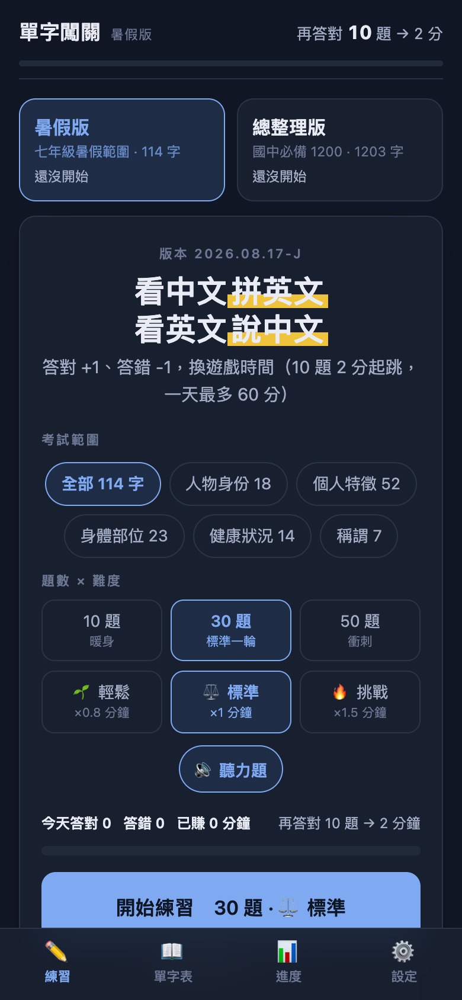
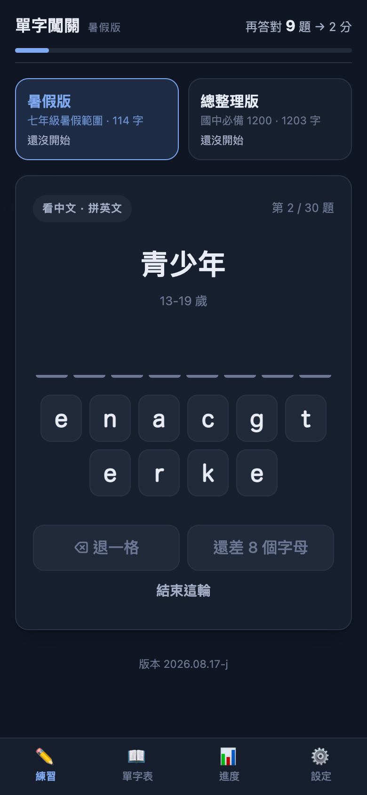
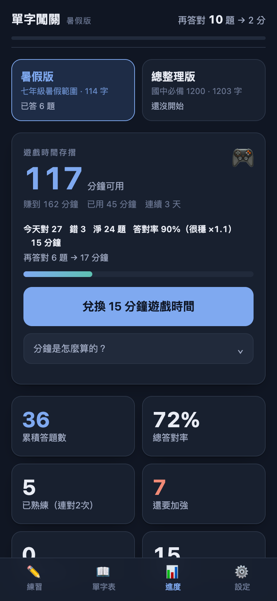
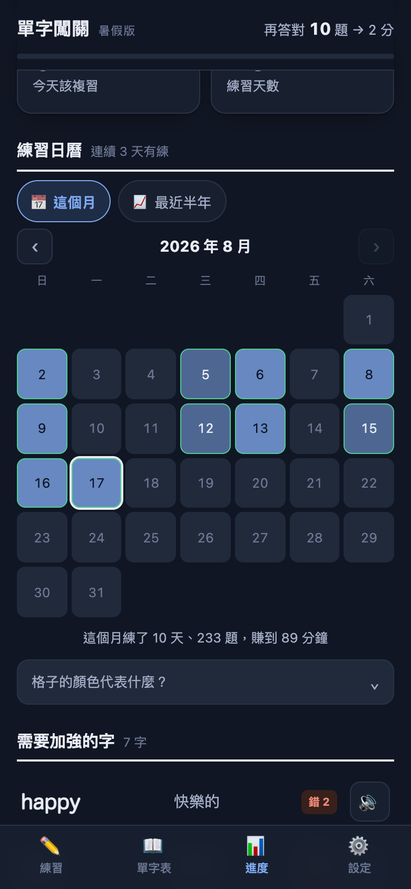
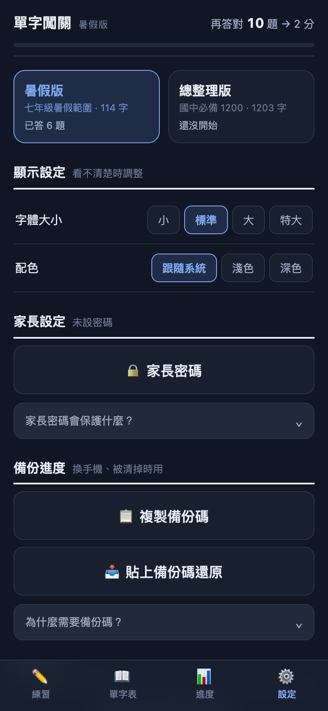

# 單字闖關

[](https://github.com/KU-isaki/vocab-quest-k7m2/actions/workflows/test.yml)

國中英語單字的手機練習網頁。**單一 HTML 檔、無後端、無安裝、離線可用**，打開就能練。

給自己家小孩做的家庭學習小工具，開源出來給有需要的人。

<p align="center">
  
  
  
  
  
</p>
<p align="center"><sub>主畫面 · 點字母拼英文 · 遊戲時間存摺 · 練習日曆 · 設定</sub></p>

---

## 快速開始

**用網頁版**：<https://ku-isaki.github.io/vocab-quest-k7m2/>

打開就能用，不用註冊、不用安裝。建議「加入主畫面」當 App 用（iOS：分享 → 加入主畫面；Android：選單 → 加到主畫面）。

**自己架一份**：

```bash
git clone https://github.com/KU-isaki/vocab-quest-k7m2.git
```

`index.html` 就是全部。用瀏覽器打開它即可，或推到任何靜態空間（GitHub Pages、Netlify、自己的伺服器都行）。

**自己改內容**：整份工具只有一個檔案，單字、例句、樣式、程式碼全在裡面。見下方「[改成自己的單字](#改成自己的單字)」。

**跑測試**：

```bash
npm install   # 只需要 jsdom
npm test      # 1150+ 項端到端測試
```

---

## 它能做什麼

### 兩個題庫

主畫面上方切換，**進度各自獨立計算、互不干擾**。

| 題庫 | 內容 |
|------|------|
| **暑假版** | 114 字，5 類（人物身份／個人特徵／身體部位／健康狀況／稱謂） |
| **總整理版** | 1203 字，37 類（附每章記憶口訣） |

### 五種題型自動混合

| 題型 | 做什麼 | 為什麼這樣設計 |
|------|--------|----------------|
| 看英文 → 選中文 | 附發音，提示「先自己念一次再選」；**點選項只是選起來，還可以改，按「檢查」才送出** | 認得出來是基本盤；手指滑到就判錯很冤 |
| 看中文 → **點字母拼英文** | 打散的字母方塊點選，可退格；**沒拼滿不能按「檢查」**，按鈕也刻意離字母遠一點 | 手機打字太痛苦，會直接勸退；按鈕太近會誤按送出錯答案 |
| **看句子填單字** | 例句挖空，用點字母的方式填 | 只背單字沒有語境 |
| **只聽發音 → 選中文** | 有大喇叭鈕可重聽 | 會考有聽力題 |
| 打出英文 | 鍵盤輸入 | 最難的一關，靠**難度**決定多常出現 |

### 題數 × 難度矩陣

開始練習前選兩件事，任意組合：

| 列 | 選項 | | |
|---|---|---|---|
| **題數** | 10 題（暖身） | 30 題（標準一輪） | 50 題（衝刺） |
| **難度** | 🌱 輕鬆 ×0.8 | ⚖️ 標準 ×1 | 🔥 挑戰 ×1.5 |

難度**只改題型配方和分鐘倍率，不會減少題數**：

| 難度 | 打字題 | 聽力題 | 升級到打字題的門檻 | 遊戲時間 |
|---|---|---|---|---|
| 輕鬆 | 少 | 少 | 連對 3 次 | ×0.8 |
| 標準 | 中 | 中 | 連對 2 次 | ×1 |
| 挑戰 | 多 | 多 | 連對 1 次 | ×1.5 |

打字題（自己拼出來、沒有字母可點）和聽力題（沒有英文可看）是最難的兩種，
挑戰模式下這兩種合起來約占七成，輕鬆模式約三成半。同樣做 30 題，
輕鬆換到 12 分鐘、標準 15 分鐘、挑戰 23 分鐘。

**倍率算的是「當天實際作答的平均」，不是切換當下的難度** —— 否則就能用輕鬆模式刷滿題數、
最後切到挑戰回頭領獎。每答一題就把當時的倍率累加起來，除以題數才是當天的倍率。

### 記憶排程（間隔重複）

答對的字排到 **1 → 3 → 7 → 14 → 30 天**後才會再出現，答錯的立刻排回來。

「已熟練」只算**連對 2 次且還沒到複習日**的字 —— 這樣這個數字才不會虛胖，家長看到的成效才是真的。

### 哪些紀錄是共用的

**練習日曆和遊戲時間存摺是兩個題庫共用的** —— 「今天練了幾題」「連續幾天」「賺到幾分鐘」
是習慣與獎勵，同一天在兩個題庫練的題數會合計。

單字本身的統計（答對率、已熟練、待加強）則分題庫各記各的，因為那是兩份不同的學習進度。

清除紀錄也分成兩個按鈕（都需要家長密碼，如果有設）：清除某個題庫的答題紀錄、
清除共用的日曆與遊戲時間。

### 練習換遊戲時間

**答對 1 題 +1，答錯 1 題 -1**，用算出來的「淨題數」換遊戲時間（淨題數最低算到 0，不會變負）。
給的是**累計到該階的總額**，所以分三次做和一次做拿到的一樣多：

| 當日累積 | 可得 |
|---|---|
| 10 題 | 2 分鐘 |
| 20 題 | 5 分鐘 |
| 30 題 | 15 分鐘 |
| 50 題 | 30 分鐘 |
| 80 題 | 60 分鐘 |

算出來的分鐘再乘上**兩個倍率**：

| 倍率 | 依據 | 級距 |
|---|---|---|
| **難度** | 自己選的難度 | 輕鬆 ×0.8　·　標準 ×1　·　挑戰 ×1.5 |
| **答對率** | 當天實際的答對率 | 95%↑ ×1.2　·　85%↑ ×1.1　·　70%↑ ×1　·　50%↑ ×0.85　·　50% 以下 ×0.7 |

所以「淨題數一樣」不代表拿到一樣多。淨 30 題的三種走法：

| 走法 | 答對率 | 拿到 |
|---|---|---|
| 對 30、錯 0 | 100% | **18 分鐘** |
| 對 40、錯 10 | 80% | 15 分鐘 |
| 對 60、錯 30 | 67% | 13 分鐘 |

**為什麼還要加答對率這層？** 淨題數只把答錯扣一次，「猜錯了再多做幾題補回來」仍然划算。
答對率直接乘在分鐘上之後，仔細作答就比硬刷題數值錢。

一天上限 60 分鐘，**連續 7 天多送 30 分鐘**。一次兌換 15 分鐘。

**存摺會跨日累積，不會每天歸零。** 60 分鐘是「一天最多能賺多少」，不是「最多能存多少」——
沒用掉的分鐘一直留著，隔天照樣往上加。每天的級距則是從 0 題重新算（今天做幾題只看今天）。

答錯會即時把已發放的分鐘**扣回來**（淨題數掉一階、答對率也可能掉一級），
畫面會跳「答錯扣抵」提示，之後再答對又會賺回去。這是為了讓亂猜沒有好處。

兌換時可以：設 4 位數家長密碼、自動複製申請訊息給家長、開始倒數計時（存的是結束時間，關掉網頁再回來也算得準）。

**家長密碼會同時保護**：兌換遊戲時間、清除題庫紀錄、清除日曆與存摺 —— 都是誤觸會出事的操作。

### 其他

- **頂端進度條**：每頁都看得到「再答對 6 題 → 17 分」，直接講還差幾題、換得到幾分鐘；到上限顯示「今日上限已滿 ✓」。長按可看今天實際答對／答錯幾題
- **練習日曆**：兩種檢視。**預設「這個月」**——一般月曆版面，一頁排得下、不用左右捲，可以往回翻月，下面有當月小結（練了幾天、幾題、賺到幾分鐘）；另一種是「最近半年」GitHub 風格熱力圖。兩種都依題數深淺上色、達標的日子有綠框、點格子看當天紀錄
- **單字表**：分類鈕篩選、搜尋中英文、點 🔊 發音、點 ⌄ 展開用法解釋與例句、顯示個人答對率
- **複習模式**：選好分類按「📇 複習這 N 個字」進入翻卡。正面英文（自動發音）→ 點卡片翻到中文、用法、例句；可切換「先看中文」反向複習。**完全不計分、不影響任何統計**
- **用法解釋 222 條**：答錯時才顯示（答對不打斷節奏），單字表可隨時展開
- **成績回報**：一鍵複製成績文字，貼到 LINE 給家長
- **可以裝成 App**：加到主畫面後有自己的圖示、全螢幕、**完全離線可用**；有新版時會跳出「立即更新」
- **四個分頁**：練習 · 單字表 · 進度 · **設定**。設定頁放顯示設定、家長密碼、備份、清除紀錄；進度頁只留成果（存摺、統計、日曆、待加強）
- **說明點一下才展開**：規則細節（分鐘怎麼算、日曆圖例、備份說明、密碼保護什麼）平常收起來，用瀏覽器原生的 `<details>`，不用自己寫展開邏輯
- **顯示設定**：字體四段大小可調、配色可選跟隨系統／淺色／深色

---

## 隱私

**這個網頁不會蒐集、上傳或傳送任何資料。** 沒有後端、沒有分析工具、沒有 cookie、沒有外部請求。

- 答題進度、錯題本、遊戲時間存摺全部存在**使用者自己瀏覽器的 localStorage**
- 別人打開同一個網址，看到的是全新的空白進度
- 「複製成績給家長」只是把文字放進剪貼簿，由使用者自己決定要不要貼出去

**刻意不做的事**：不用 `line.me/R/msg/text/?...` 那種把訊息塞進網址的分享方式 —— 那會把成績整段送到 LINE 的伺服器，也會留在瀏覽器歷史紀錄裡。

### 進度會不會不見？

會。localStorage 在下列情況會被清掉：換瀏覽器、清除瀏覽資料、iOS Safari 長時間沒開啟該網站。

所以做了**備份碼**：進度頁按「📋 複製備份碼」，把兩個題庫的紀錄壓成一段約 2900 字元的文字（貼得進一則 LINE 訊息），需要時貼回來還原。

---

## 已知限制

| 狀況 | 說明 |
|------|------|
| **iPhone 側邊靜音開關打開時完全沒聲音** | iOS 的限制，程式救不了。所有題目都看得到英文字，沒聲音仍可正常作答；聽力題也可以在主畫面一鍵關掉 |
| **LINE 內建瀏覽器可能沒聲音、無法自動複製** | 偵測到會自動跳提示，請用右上角 `⋯` →「用其他瀏覽器開啟」。複製失敗時會跳出面板讓你長按手動複製 |
| **換瀏覽器開進度會歸零** | localStorage 是分瀏覽器的，請固定用同一個。或用備份碼搬移 |
| **語音品質看裝置** | 用的是瀏覽器內建的 `speechSynthesis`，各家發音品質不同。沒有預錄音檔，換取的是檔案小、零維護 |

---

## 改成自己的單字

整份工具就是 `index.html` 一個檔案，用任何編輯器打開，找到對應區塊改就好。改完存檔、重開網頁即可。若是用 GitHub Pages 發布，`git push` 後最多 10 分鐘生效（網址不變）。

### 一輪幾題、獎勵多少

```js
const ROUND  = 30;        // 預設一輪幾題
const SIZES  = [{n:10,tag:"暖身"},{n:30,tag:"標準一輪"},{n:50,tag:"衝刺"}];   // 題數矩陣第一列
const LEVELS = [             // 難度矩陣第二列：mul 是分鐘倍率
  {id:"easy", name:"🌱 輕鬆", mul:0.8, note:"多選擇題，打字題少"},
  {id:"std",  name:"⚖️ 標準", mul:1,   note:"各種題型平均出"},
  {id:"hard", name:"🔥 挑戰", mul:1.5, note:"打字題與聽力題變多"}
];
const MIX = {                // 每個難度的題型配方
  easy: {listen:.15, need:3, typeP:.25, kinds:["spell","en2zh","en2zh","en2zh"], ear:1},
  // listen=不能拼的字改出聽力題的機率、need=連對幾次才升級打字題、
  // typeP=符合條件時真的出打字題的機率、kinds=其餘題型的抽籤袋、ear=聽力題在袋子裡放幾張
};
const TIERS  = [{n:10,m:2},{n:20,m:5},{n:30,m:15},{n:50,m:30},{n:80,m:60}];  // 當日淨題數 → 可換的分鐘數
const ACC    = [             // 當日答對率 → 分鐘倍率（由高到低，第一個命中的算數）
  {p:.95,m:1.2,name:"幾乎全對"},{p:.85,m:1.1,name:"很穩"},{p:.70,m:1,name:"及格"},
  {p:.50,m:.85,name:"要小心"},{p:0,m:.7,name:"太多錯"}
];
const SPEND  = 15;        // 一次兌換幾分鐘
const STREAK_BONUS = 30;  // 連續 7 天的紅利分鐘
```

畫面上的文案會自動跟著這些數字變，不用另外改。

### 單字

```js
const SUMMER_WORDS = [
["單字", "中文意思", "提示（可留空）", "分類 id"],
];
```

分類 id 在同區塊上方的 `SUMMER_CATS` 定義。總整理版是 `FULL_WORDS`，格式是 `["單字", "中文", "分類 id（多個用逗號分隔）"]`，分類在 `FULL_CATS`（含記憶口訣）。

自動處理的事：

- 純英文字母的單字會自動加入拼字題；含 `.`、`-` 或空格的（`Mr.`、`hard-working`、`hot dog`）自動只出選擇題
- 中文一模一樣的字（`tall` / `high` 都是「高的」）會自動：不互相當干擾選項、拼字與打字題兩個都算對

### 用法解釋

```js
const NOTES = {
"honest":"形容詞，開頭 h 不發音，所以前面冠詞用 an honest man。",
};
```

兩個題庫共用，key 用小寫單字。沒寫的字就不顯示說明區塊，不用硬湊。

### 例句

```js
const EXAMPLES = {
"honest":["Please be honest with your parents.","請對你的父母誠實。"],
};
```

**例句裡一定要有該單字的原形** —— 不能只有 `taller` 這種變化形，否則挖空挖不掉。這是最容易踩的坑，測試會擋下來。

---

## 測試

用 jsdom 跑端到端測試，涵蓋：

- 答題流程、退格、錯題加權、只考錯題模式、搜尋、清除紀錄
- **選擇題要按「檢查」才送出**：點選項只做標記、可以改、不得洩漏正確答案、算的是最後選的那個
- **難度矩陣**：三種難度都要出滿選定的題數、打字題與聽力題比例隨難度遞增、倍率不得回頭追加
- **答對率倍率**：同樣的淨題數，錯越多必須拿越少；亂猜補題數不得比穩穩答還多；再高的答對率也不得破每日上限
- **出題不重複**：同一輪不得出現同一個字、不同輪的順序不得完全相同、同一個字換輪要換題型
- 題庫切換與進度隔離
- 選擇題四個選項的中文不得重複、同義字（`tall` / `high`）兩個都要算對
- **實際渲染狀態**：每個該隱藏的元素其 computed display 必須是 `none`（曾出過「複製面板一載入就跳出來」的 bug）
- **按鈕配色**：CSS 優先度不得讓通用規則蓋掉次要按鈕的文字色（曾出過白底白字的隱形按鈕）
- 中途結束一輪時分母要等於實際答題數、答對率要等於累積答對 ÷ 累積答題
- 遊戲時間：級距換算、分次做與一次做總額必須相同、密碼錯誤不得扣款、申請訊息不得含網址
- 備份碼往返後資料完全一致（含 `Mr.`、`hard-working` 這類含符號的字）
- 例句挖空：每個可拼字的字都要能被挖掉、字母數要對得上、句子裡不得洩漏答案
- 複習翻卡不得影響任何答題統計
- **設定頁**：導覽列欄數要跟分頁數一致、設定類元件要真的搬過去（進度頁不得殘留）、可展開的說明預設要收起來且內容不得為空

每次 `git push` 由 GitHub Actions 自動跑一次（見上方徽章），本機用 `npm test`。

---

## 設計取捨

留給想改的人參考：

**為什麼手機不用打字？** 國中生用手機鍵盤拼英文單字很痛苦，會直接放棄。所以主力題型是「點打散的字母方塊」，鍵盤輸入只留給已經連對幾次的字（幾次由難度決定）。

**為什麼難度只加分鐘、不減題數？** 如果難度可以換成「少做幾題」，最省力的路徑就是把難度拉到最低、題數拉到最少。所以三個難度的題數門檻完全一樣，選挑戰只有一個效果：同樣的題數更難，但更值錢。

**為什麼不用預錄音檔？** 1300 多個字的 mp3 至少幾 MB，還要維護。用瀏覽器內建的 `speechSynthesis` 是零檔案、零維護，代價是各裝置發音品質不一。

**為什麼是單一 HTML 檔？** 家長不想維護。沒有 build、沒有依賴、沒有伺服器，複製一個檔案就能跑，十年後打開應該還能用。

**為什麼跨章節重複的字要合併？** 原始資料 1288 筆裡有 85 個字跨章節重複（例如 `short` 同時在「個人特徵」和「尺寸度量」）。不合併的話，選擇題會出現兩個都對的答案。

**為什麼測試要檢查 computed style？** 因為 `hidden` 屬性會被 CSS 蓋掉（`.sheet{display:grid}` 讓複製面板一載入就跳出來）、CSS 優先度會讓按鈕變成白底白字、flex 項目的 `min-height:auto` 會把日曆格子撐開、`aspect-ratio` 的自動最小尺寸會把 `1fr` 欄寬撐爆（7 欄變成 568px 塞進 358px 的容器）。這些都不是 DOM 結構的問題，只驗 DOM 抓不到。

**為什麼日曆格子的 class 要測撞名？** 月檢視的達標格子原本取名 `.goal`，撞到每日目標區塊既有的 `.goal{margin:16px 0 14px}`，達標的日子就被推低 16px、整個月曆歪掉。測試會抓出「加在格子上的修飾 class 有裸規則」這種情況。

---

## 授權

程式碼採 MIT 授權，歡迎自由使用修改。

**單字與例句內容僅供個人與家庭學習使用。** 單字表整理自國中英語基本字彙，例句為自行撰寫與生成。若你要用於其他用途，請自行確認內容適用性。
